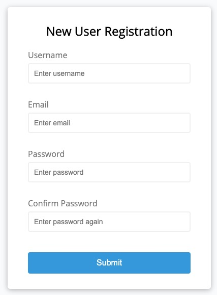
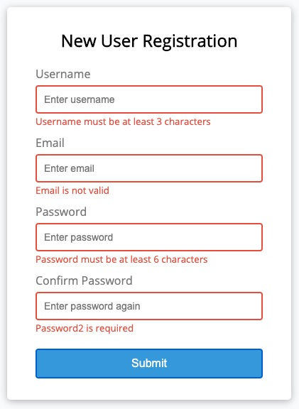
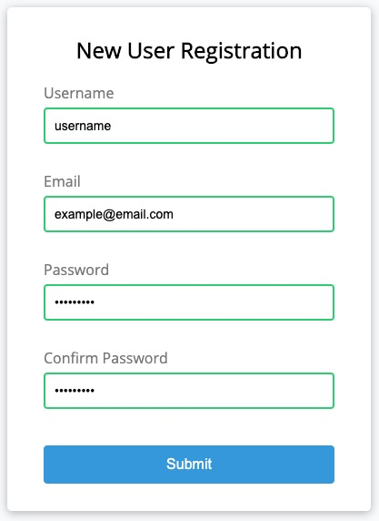

# Signup Form Validation Template

> 🔌⚡️ A plug-and-play-ready signup form, complete with username, email, and password field validation.

This project template ships with four standard fields, ready to be implemented into your next project: username, email, password, and password confirmation.

## Installation

A brute-force approach to installation, simply copy the code you'd like to implement from `index.html`, `style.css`, and `script.js`. Is it pretty? No. I just tell myself it's like being on Stack Overflow.

  
  
  

<table><tbody><tr><th></th></tr></tbody></table> <!-- Image alignment clearfix -->
